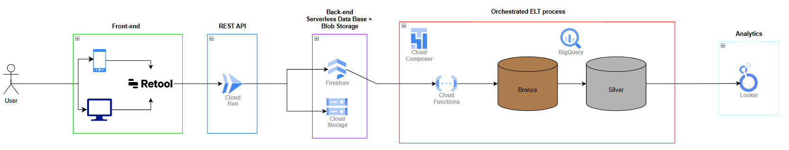
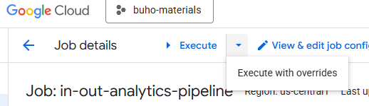
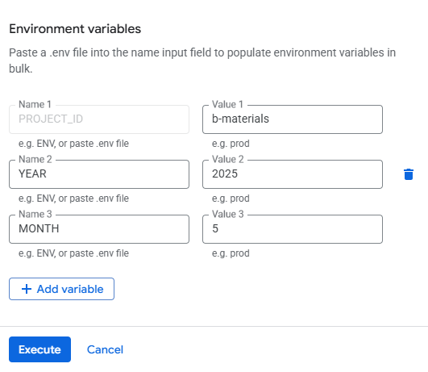
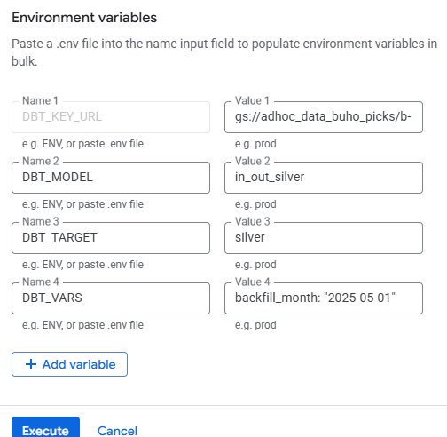

# App Entradas-Salidas

A solution for tracking goods entering and exiting warehouses. This project includes a Go-based REST API, an analytics pipeline with dbt and Airflow, and Terraform-based infrastructure-as-code for Google Cloud Platform (GCP).

---

## Table of Contents

- [Overview](#overview)
- [Architecture](#architecture)
- [Deploying Containers to GCP](#deploying-containers-to-gcp)
- [Backend (Go API)](#backend-go-api)
- [Analytics & Data Pipeline](#analytics-and-data-pipeline)
- [Infrastructure (Terraform)](#infrastructure-terraform)
- [Deploying Infrastructure to GCP](#deploying-infrastructure-to-gcp)
- [Setup & Deployment](#setup-and-deployment)
- [Running Backfill Pipelines](#backfill-pipelines)
- [License](#license)
- [Contact](#contact)

---

## Overview

This project provides a comprehensive warehouse management system with the following components:

- **REST API**: Built in Go, integrated with Firestore, and consumed by Retool for web/mobile interfaces.
- **Analytics Pipeline**: Uses Python, dbt, and Airflow for ELT processes and dashboarding.
- **Infrastructure-as-Code**: Provisions GCP resources via Terraform for scalable deployments.
- **GCP-Native Deployment**: Leverages Cloud Run, BigQuery, Google Cloud Storage, and Firestore.

---

## Architecture

The system follows a modular, cloud-native architecture:

- **Frontend**: Retool-based web/mobile apps for user interaction, consuming the Go API.
- **Backend**: Go REST API hosted on Cloud Run Service, handling authentication, CRUD operations, and business logic, with Firestore as the primary database.
- **Data Pipeline**: Python EL extracts data from Firestore and loads it into BigQuery bronze dataset. dbt models transform data into silver, orchestrated by Airflow DAGs running on Google Cloud Composer.
- **Infrastructure**: Terraform provisions VPC, Cloud Run, Firestore, BigQuery, GCS, and IAM roles for secure access.
- **Storage & Analytics**: BigQuery hosts processed datasets in a Medallion Architecture, and Firestore manages near real-time inventory.

Data flows from user inputs (Retool → API → Firestore) to analytics (BigQuery → dbt → Looker).

**Infra Diagram:**



---

## Deploying Containers to GCP

Container images must be built and pushed to GCP Artifact Registry before deploying services.

### GCP Prerequisites

- GCP project with Artifact Registry enabled.
- Docker installed and authenticated with `gcloud auth configure-docker`.
- Replace `[PROJECT_ID]` with your GCP project ID.

### Steps

```bash
# Navigate to the backend module
cd backend

# Build the Docker image
docker build -t in-out-backend:v1 .

# Tag the image for GCP Artifact Registry
docker tag in-out-backend:v1 gcr.io/[PROJECT_ID]/in-out-backend:v1

# Push the image to Artifact Registry
docker push gcr.io/[PROJECT_ID]/in-out-backend:v1
```

Repeat for the analytics module (analytics/in_out_dbt_analytics).

---

## Backend Go API

Located in backend/, the Go-based REST API manages core warehouse operations.

### Features

Authentication Firestore based.
Firestore CRUD operations for warehouse management.
Business logic for goods movement (entries/exits).
Customer admin (self service to register new customers for the app).
ASN update module.

---

## Analytics and Data Pipeline

Located in analytics/, this module processes warehouse data for reporting and ML use cases.

### Components

fetch.py, load.py: Python scripts for EL (extract from Firestore, load to GCS/BigQuery).
in_out_dbt_analytics/: dbt models for data transformation (transform from bronze to silver).
dags/: Airflow DAGs for pipeline orchestration.

### Purpose

Extract raw data from Firestore with Python.
Load to GCS and BigQuery.
Transform with dbt for dashboards and ML-ready datasets.
Orchestrate with Airflow (Cloud Composer)

### Dags
`in_out_analytics_pipeline`: This DAG orchestrates the ELT process for the In & Out Transactional System using the Cloud Run Jobs: in-out-analytics-pipeline and the in-out-analytics-dbt-job.

`DAG Schedule:` runs at 06:00 on the 1st of the month

---

## Infrastructure (Terraform)

Located in terraform/, this module provisions GCP resources.

### Resources

Compute: Cloud Run for hosting the API.
Storage: Firestore for real-time data, GCS for raw data, BigQuery for analytics.
Networking: VPC, subnets, and firewall rules.
IAM: Service accounts and roles for secure access.

### Key Files

main.tf: Core resource definitions.
variables.tf: Configuration variables (e.g., project ID, region).
outputs.tf: Exported resource attributes.

---

## Deploying Infrastructure to GCP

Deploy infrastructure using Terraform after configuring variables.

### Terraform Prerequisites

Terraform installed.
GCP credentials configured (gcloud auth application-default login).
Update variables.tf with your project ID and region.

### Terraform Steps

```bash
# Navigate to Terraform directory
cd terraform

# Initialize Terraform
terraform init

# Preview changes
terraform plan

# Apply changes
terraform apply
```

## Setup and Deployment

- **Build and Push Containers**:  
  Follow [Deploying Containers to GCP](#deploying-containers-to-gcp).

- **Provision Infrastructure**:  
  Run Terraform as described in [Deploying Infrastructure to GCP](#deploying-infrastructure-to-gcp).

- **Deploy Backend**:  
  - Deploy the Go API to Cloud Run using the pushed image (`gcr.io/[PROJECT_ID]/in-out-backend:v1`).
  - Configure environment variables (e.g., Firestore credentials) in Cloud Run.

- **Configure Analytics Pipeline**:  
  - Set up Airflow (via GCP Composer) and upload DAGs from `analytics/dags/`.
  - Run ETL scripts (`fetch.py`, `load.py`) manually or via Airflow.
  - Execute dbt models (`dbt run` in `analytics/in_out_dbt_analytics/`).

- **Set Up Secrets**:  
  - Use GCP Secret Manager for sensitive data (e.g., API keys).
  - Configure service accounts with appropriate IAM roles via Terraform.

- **Test the Application**:  
  - Access the API via Retool or `cURL`.
  - Verify data in BigQuery and dashboards.

---

## Backfill Pipelines

Whenever you need to re run the analytics pipeline for a specific month, you need to manually
execute the cloud run jobs.

First, execute the `in-out-analytics-pipeline` , with **overrides**:
`YEAR`: (your target year)
`MONTH`: (your target month)

**Access run with overrides:**



**Pass overrides:**



What this does is overriding the default configs of the extraction and loading to bronze logic
in the container - it will do so for the year and month that you pass by.

Then, execute the `in-out-analytics-dbt-job` , with **overrides**:
`DBT_MODEL`: (the name of your desired model)
`DBT_TARGET`: (the name of your target)
`DBT_VARS`: (backfill_month: "2025-05-01") ***replace the YYYY-mm-dd date with the date you used for step 1***

**Access run with overrides:**


**Pass overrides:**



This should generate these logs:

Running dbt with:
DBT_MODEL: in_out_silver
DBT_TARGET: silver
DBT_VARS: backfill_month: "2025-05-01"
Running dbt run for in_out_silver , silver ...
Running: dbt run --select "in_out_silver" --target "silver" --vars 'backfill_month: "2025-05-01"'

The last command will basically tell dbt to erase data for that specific month and load the data
from the bronze table (even if the incremental loading enforces only data data above the max date
in the `fecha_movimiento` column).

---

## License

This project is licensed under the Mozilla Public License 2.0.

---

## Contact

Carlos Lopez
``clopez@buhoms.com``
